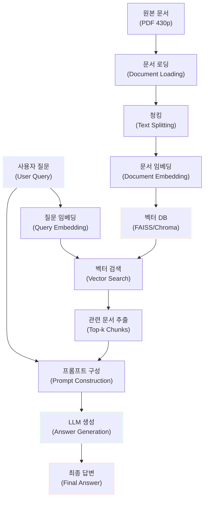
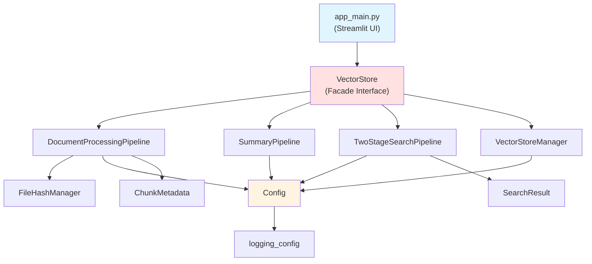

# RAG 시스템 구축 가이드: 연말정산 문서 기반 질의응답 시스템

## 목차

- [1. 프로젝트 개요](#1-프로젝트-개요)<br/>
  - [1.1. 미션 목표](#11-미션-목표)<br/>
  - [1.2. 사용 데이터셋](#12-사용-데이터셋)<br/>
  - [1.3. 개발 환경 및 기간](#13-개발-환경-및-기간)<br/>
  - [1.4. MVP 구성 전략](#14-mvp-구성-전략)<br/>
- [2. RAG 시스템 아키텍처](#2-rag-시스템-아키텍처)<br/>
  - [2.1. RAG 개념 및 동작 원리](#21-rag-개념-및-동작-원리)<br/>
  - [2.2. 시스템 구성 요소](#22-시스템-구성-요소)<br/>
  - [2.3. 전체 파이프라인 다이어그램](#23-전체-파이프라인-다이어그램)<br/>
- [3. 문서 전처리](#3-문서-전처리-document-processing)<br/>
  - [3.1. PDF 문서 로딩 전략](#31-pdf-문서-로딩-전략)<br/>
  - [3.2. 청킹 전략](#32-청킹-전략chunking-strategy)<br/>
  - [3.3. 최적 청킹 실험 방법론](#33-최적-청킹-실험-방법론)<br/>
- [4. 임베딩 및 벡터 저장소 구축](#4-임베딩-및-벡터-저장소-구축)<br/>
  - [4.1. 한국어 임베딩 모델 선정](#41-한국어-임베딩-모델-선정)<br/>
  - [4.2. 벡터 데이터베이스 선택](#42-벡터-데이터베이스-선택)<br/>
  - [4.3. 임베딩 생성 및 저장 구현](#43-임베딩-생성-및-저장-구현)<br/>
- [5. 언어 모델 설정](#5-언어-모델-설정)<br/>
  - [5.1. 한국어 LLM 모델 선정](#51-한국어-llm-모델-선정)<br/>
  - [5.2. 양자화 적용](#52-양자화quantization-적용)<br/>
  - [5.3. 생성 파라미터 튜닝](#53-생성-파라미터-튜닝)<br/>
- [6. RAG 파이프라인 구현](#6-rag-파이프라인-구현)<br/>
  - [6.1. LangChain 기반 구현](#61-langchain-기반-구현)<br/>
  - [6.2. 검색 전략](#62-검색-전략)<br/>
  - [6.3. 컨텍스트 윈도우 관리](#63-컨텍스트-윈도우-관리)<br/>
- [7. 성능 평가 및 테스트](#7-성능-평가-및-테스트)<br/>
  - [7.1. 테스트 질문 설계](#71-테스트-질문-설계)
  - [7.2. 평가 지표](#72-평가-지표)<br/>
  - [7.3. 실험 결과 분석](#73-실험-결과-분석)<br/>
  - [7.4. 일반적인 문제점 및 해결 방법](#74-일반적인-문제점-및-해결-방법)<br/>
- [8. 실전 구현 가이드](#8-실전-구현-가이드)<br/>
  - [8.1. 환경 설정](#81-환경-설정)<br/>
  - [8.2. 단계별 구현 절차](#82-단계별-구현-절차)<br/>
  - [8.3. TrainingArguments 스타일 간소화 팁](#83-trainingarguments-스타일-간소화-팁)<br/>
  - [8.4. 디버깅 및 트러블슈팅](#84-디버깅-및-트러블슈팅)<br/>
- [9. 연말정산 문서 특화 가이드](#9-연말정산-문서-특화-가이드)<br/>
  - [9.1. 문서 특성 분석](#91-문서-특성-분석)<br/>
  - [9.2. 효과적인 질문 예시](#92-효과적인-질문-예시)<br/>
  - [9.3. 주의사항](#93-주의사항)<br/>
- [10. 프로젝트 리팩토링 아키텍처](#10-프로젝트-리팩토링-아키텍처)<br/>
  - [10.1. 클린 아키텍처 도입](#101-클린-아키텍처-도입)<br/>
  - [10.2. 모듈별 상세 설명](#102-모듈별-상세-설명)<br/>
  - [10.3. Progress Callback 시스템](#103-progress-callback-시스템)<br/>
  - [10.4. 리팩토링 이점](#104-리팩토링-이점)<br/>
  - [10.5. 마이그레이션 가이드](#105-마이그레이션-가이드)<br/>
- [부록 A. 심화 RAG 기법](#부록-a-심화-rag-기법)<br/>
- [부록 B. 대안 LLM API 실험](#부록-b-대안-llm-api-실험)<br/>
- [부록 C. 체크리스트](#부록-c-체크리스트)<br/>
- [용어 목록](#용어-목록-glossary)<br/>

---

## 1. 프로젝트 개요

### 1.1. 미션 목표

이 프로젝트는 **리트리벌 증강 생성(RAG, Retrieval-Augmented Generation)** 시스템을 구축하여, 외부 문서의 정보를 참고해 정확한 답변을 생성하는 질의응답 시스템을 개발하는 것을 목표로 합니다.

**핵심 목표:**
- 대용량 문서(430페이지)를 효과적으로 처리하고 검색할 수 있는 시스템 구축
- 한국어 문서에 최적화된 임베딩 및 LLM 모델 선정 및 적용
- 사용자 질문에 대해 문서 기반의 정확하고 신뢰할 수 있는 답변 생성

### 1.2. 사용 데이터셋

**데이터셋:** 국세청 발간 『2024년 연말정산 신고 안내』 문서

**문서 특성:**
- **분량:** 약 430페이지
- **내용:** 연말정산 절차, 공제 항목, 2024년 개정 세법, 주의사항 등
- **구조:** 표, 목록, 단락 형식의 혼합 구조
- **난이도:** 전문 용어가 많고, 세법 개정 사항 등 시의성 있는 정보 포함

**RAG 시스템 검증에 적합한 이유:**
- 구체적이고 사실 기반의 정보로 답변 정확도 평가 가능
- 복잡한 표 데이터와 텍스트가 혼재되어 전처리 능력 테스트 가능
- 실제 사용자 니즈가 높은 도메인으로 실용성 검증 가능

### 1.3. 개발 환경 및 기간

**개발 환경:**
- Python 3.9 이상
- GPU 권장 (CUDA 지원), CPU 환경에서도 가능 (처리 속도 저하)
- RAM: 최소 16GB (양자화 사용 시 8GB 가능)
- 디스크 공간: 최소 10GB (모델 및 벡터 DB 저장)

**필수 라이브러리:**
- LangChain
- Hugging Face Transformers
- PyMuPDF4LLM
- FAISS 또는 Chroma
- Sentence Transformers

### 1.4. MVP 구성 전략

MVP 개발 원칙은 **"완벽보다 작동"**입니다. 핵심 기능을 먼저 구현하고, 점진적으로 개선합니다.

**우선순위:**

**데이터 파이프라인 구축**
- PDF 로딩 및 텍스트 추출
- 기본 청킹 (고정 크기)
- 벡터 DB 저장

**RAG 시스템 기본 구현**
- 임베딩 모델 로드
- LLM 모델 로드 (양자화)
- 기본 검색 및 답변 생성

**테스트 및 최적화**
- 다양한 질문으로 테스트
- 청크 크기, Top-k 등 파라미터 튜닝

**문서화 및 심화 (선택)**
- 결과 정리
- (시간 여유 시) 심화 기법 실험

---

## 2. RAG 시스템 아키텍처

### 2.1. RAG 개념 및 동작 원리

**RAG(Retrieval-Augmented Generation)**는 대규모 언어 모델(LLM)의 답변 생성 과정에 외부 지식 검색(Retrieval) 단계를 결합한 기술입니다.

**기존 LLM의 한계:**
- 학습 데이터에 없는 최신 정보나 특정 도메인 지식 부족
- 환각(Hallucination) 현상: 그럴듯하지만 틀린 정보 생성
- 출처 불명확

**RAG의 해결책:**
1. 사용자 질문을 받으면, 관련 문서를 검색 (Retrieval)
2. 검색된 문서를 컨텍스트로 제공하여 답변 생성 (Generation)
3. 문서 기반 답변으로 정확도 향상 및 출처 명확화

**수학적 표현:**

기존 LLM 답변 생성:

$$P(\text{Answer} | \text{Query})$$

RAG 답변 생성:

$$P(\text{Answer} | \text{Query}, \text{Retrieved Documents})$$

검색된 문서 $D$가 컨텍스트로 추가되어 답변의 신뢰도가 향상됩니다.

### 2.2. 시스템 구성 요소

RAG 시스템은 다음 6개의 핵심 컴포넌트로 구성됩니다.

#### 2.2.1. 문서 로더(Document Loader)

**역할:** PDF, DOCX, TXT 등 다양한 형식의 문서를 읽어 텍스트로 변환합니다.

**연말정산 문서 처리 시 고려사항:**
- 표 데이터 보존
- 레이아웃 정보 유지
- 페이지 번호 등 메타데이터 추출

#### 2.2.2. 텍스트 스플리터(Text Splitter)

**역할:** 긴 문서를 검색 가능한 작은 단위(청크, Chunk)로 분할합니다.

**중요성:**
- 너무 크면: 검색 정밀도 저하, 관련 없는 정보 포함
- 너무 작으면: 문맥 손실, 의미 파악 어려움

#### 2.2.3. 임베딩 모델(Embedding Model)

**역할:** 텍스트를 고차원 벡터로 변환하여 의미적 유사도를 계산 가능하게 합니다.

**수식:**

$$\text{embedding} = f_{\theta}(\text{text}) \in \mathbb{R}^d$$

여기서 $f_{\theta}$는 임베딩 모델, $d$는 벡터 차원 (보통 384, 768, 1024 등)입니다.

#### 2.2.4. 벡터 데이터베이스(Vector Database)

**역할:** 임베딩 벡터를 저장하고 빠르게 검색합니다.

**주요 연산:** 코사인 유사도(Cosine Similarity)

$$\text{similarity}(\mathbf{v}_1, \mathbf{v}_2) = \frac{\mathbf{v}_1 \cdot \mathbf{v}_2}{\|\mathbf{v}_1\| \|\mathbf{v}_2\|}$$

#### 2.2.5. 리트리버(Retriever)

**역할:** 사용자 질문과 가장 유사한 문서 청크를 벡터 DB에서 검색합니다.

**검색 알고리즘:**
- Similarity Search: 단순 유사도 기반 Top-k 검색
- MMR (Maximal Marginal Relevance): 다양성을 고려한 검색

#### 2.2.6. 언어 모델(LLM)

**역할:** 검색된 문서를 바탕으로 최종 답변을 생성합니다.

**프롬프트 구조:**
```
주어진 문맥을 참고하여 질문에 답하세요.

문맥: {retrieved_documents}

질문: {user_question}

답변:
```

### 2.3. 전체 파이프라인 다이어그램



**데이터 흐름:**

1. **오프라인 단계 (문서 인덱싱):**
   - 원본 문서 → 로딩 → 청킹 → 임베딩 → 벡터 DB 저장

2. **온라인 단계 (질의응답):**
   - 사용자 질문 → 임베딩 → 벡터 검색 → 관련 문서 추출 → LLM 답변 생성

---

## 3. 문서 전처리 (Document Processing)

### 3.1. PDF 문서 로딩 전략

#### 3.1.1. PyMuPDF4LLM vs 대안들

연말정산 문서는 표와 복잡한 레이아웃이 많으므로, 문서 구조를 최대한 보존하는 로더가 필요합니다.

**추천: PyMuPDF4LLM**

**장점:**
- PDF를 마크다운(Markdown)으로 변환하여 구조 보존
- 표(Table) 데이터를 마크다운 테이블로 변환
- 빠른 처리 속도
- 페이지 번호, 제목 등 메타데이터 추출 용이

**설치:**
```bash
pip install pymupdf4llm
```

**기본 사용법:**
```python
import pymupdf4llm

# PDF를 마크다운으로 변환
md_text = pymupdf4llm.to_markdown("연말정산_안내.pdf")

# 페이지별로 분리하여 로딩
pages = pymupdf4llm.to_markdown(
    "연말정산_안내.pdf",
    pages=range(1, 151)  # 첫 150페이지만 로딩 (MVP 전략)
)
```

**대안 1: PDFPlumber**

**장점:**
- 표 추출 정확도가 매우 높음
- 레이아웃 분석 기능 우수

**단점:**
- 처리 속도가 상대적으로 느림
- 추가 전처리 코드 필요

**대안 2: Unstructured**

**장점:**
- 다양한 문서 타입 지원
- 자동 레이아웃 감지

**단점:**
- 의존성 패키지가 많음
- 설정이 복잡함

**선택 가이드:**

| 상황 | 추천 도구 |
|------|----------|
| MVP 빠른 구현 | PyMuPDF4LLM |
| 표 정확도 최우선 | PDFPlumber |
| 다양한 문서 타입 처리 | Unstructured |

#### 3.1.2. 표(Table) 데이터 처리

연말정산 문서의 표는 공제율, 한도 등 중요한 정보를 담고 있습니다.

**PyMuPDF4LLM의 표 처리 예시:**

원본 PDF 표:
```markdown
| 소득 구간 | 공제율 |
|-----------|--------|
| 1,200만원 이하 | 15% |
| 4,600만원 이하 | 24% |
```

마크다운 변환 결과:
```markdown
| 소득 구간 | 공제율 |
|-----------|--------|
| 1,200만원 이하 | 15% |
| 4,600만원 이하 | 24% |
```

**표 데이터 청킹 시 주의사항:**
- 표의 헤더와 데이터 행이 분리되지 않도록 청크 크기 조정
- 표 전체를 하나의 청크로 유지하는 것이 이상적
- 표가 너무 크면 요약 또는 중요 행만 추출 고려

#### 3.1.3. 메타데이터 추출

메타데이터는 검색 정확도를 높이는 데 중요합니다.

**추출 가능한 메타데이터:**
- 페이지 번호
- 섹션 제목
- 문서 타입 (표, 일반 텍스트, 목록 등)

**LangChain Document 객체 활용:**
```python
from langchain.schema import Document

documents = []
for page_num, page_text in enumerate(pages, start=1):
    doc = Document(
        page_content=page_text,
        metadata={
            "source": "연말정산_안내.pdf",
            "page": page_num,
            "year": 2024
        }
    )
    documents.append(doc)
```

### 3.2. 청킹 전략(Chunking Strategy)

#### 3.2.1. 청킹의 중요성

청킹은 RAG 시스템의 성능을 결정하는 가장 중요한 요소 중 하나입니다.

**청킹이 필요한 이유:**
1. LLM의 컨텍스트 윈도우 제한 (대부분 4k-8k 토큰)
2. 검색 정밀도 향상 (관련 없는 정보 최소화)
3. 비용 절감 (API 사용 시)

**잘못된 청킹의 예:**

청크가 너무 큰 경우:
```
[청크 1] 연말정산 전체 가이드 (10,000단어)
→ 질문: "월세 공제율은?"
→ 문제: 월세와 무관한 정보 9,500단어가 LLM에 전달됨
```

청크가 너무 작은 경우:
```
[청크 47] "월세 세액공제는"
[청크 48] "소득에 따라 10% 또는 12%입니다."
→ 문제: 청크 47만 검색되면 답변 불완전
```

#### 3.2.2. 청크 크기 결정 가이드

**일반적인 청크 크기 권장사항:**

| 문서 특성 | 청크 크기 (문자 수) | 토큰 수 (근사치) |
|-----------|---------------------|------------------|
| 짧은 FAQ | 200-400 | 50-100 |
| 일반 문서 | 800-1200 | 200-300 |
| 기술 문서 | 1200-1800 | 300-450 |
| 표 포함 문서 | 1500-2500 | 375-625 |

**연말정산 문서 권장값:**
- **청크 크기:** 1000-1500 문자
- **이유:** 표와 설명이 함께 있는 경우가 많아 충분한 컨텍스트 필요

**청크 크기 계산 공식:**

토큰 수를 기준으로 계산:

$$\text{Chunk Size (chars)} \approx \text{Target Tokens} \times 4$$

(한국어는 평균 1토큰 ≈ 4문자)

#### 3.2.3. 오버랩(Overlap) 설정

**오버랩이란?** 인접한 청크 간에 중복되는 텍스트 영역입니다.

**오버랩의 필요성:**
- 청크 경계에서 문맥이 끊기는 것을 방지
- 문장이나 단락이 분할되지 않도록 보호

**시각화:**

```
[청크 1] [--------------------] [오버랩]
                          [오버랩] [--------------------] [청크 2]
```

**권장 오버랩 비율:**

$$\text{Overlap} = 0.1 \sim 0.2 \times \text{Chunk Size}$$

**예시:**
- 청크 크기: 1000문자
- 오버랩: 150-200문자 (15-20%)

#### 3.2.4. 의미 기반 vs 구조 기반 청킹

**1. 고정 크기 청킹 (Character-based)**

가장 단순한 방법으로, 고정된 문자 수로 분할합니다.

```python
from langchain.text_splitter import RecursiveCharacterTextSplitter

text_splitter = RecursiveCharacterTextSplitter(
    chunk_size=1000,
    chunk_overlap=200,
    separators=["\n\n", "\n", ".", " ", ""]  # 우선순위대로 분할
)

chunks = text_splitter.split_text(md_text)
```

**장점:** 구현 간단, 빠름  
**단점:** 의미 단위 무시 가능

**2. 마크다운 기반 청킹 (Markdown-based)**

마크다운 구조(헤더, 리스트 등)를 인식하여 분할합니다.

```python
from langchain.text_splitter import MarkdownTextSplitter

md_splitter = MarkdownTextSplitter(
    chunk_size=1500,
    chunk_overlap=200
)

chunks = md_splitter.split_text(md_text)
```

**장점:** 문서 구조 보존, 의미 단위 유지  
**단점:** 마크다운 형식 필요

**3. 의미 기반 청킹 (Semantic Chunking)**

문장 임베딩을 사용하여 의미적으로 유사한 문장들을 묶습니다.

**개념:**
1. 각 문장을 임베딩
2. 인접 문장 간 유사도 계산
3. 유사도가 급격히 변하는 지점에서 분할

**장점:** 의미 단위 완벽 보존  
**단점:** 계산 비용 높음, 구현 복잡

**선택 가이드:**

| 단계 | 추천 방법 |
|------|-----------|
| MVP (Day 1-2) | RecursiveCharacterTextSplitter |
| 최적화 (Day 4) | MarkdownTextSplitter |
| 심화 (선택) | Semantic Chunking |

### 3.3. 최적 청킹 실험 방법론

청킹 파라미터를 체계적으로 실험하여 최적값을 찾는 방법입니다.

**실험 설계:**

**1단계: 기준 질문 세트 준비**
```python
test_questions = [
    "월세 세액공제 대상자는?",
    "비거주자의 연말정산 주의사항은?",
    "2024년 개정된 주택 관련 공제는?",
    # ... 10개 정도
]
```

**2단계: 파라미터 그리드 설정**
```python
chunk_sizes = [500, 1000, 1500, 2000]
overlaps = [100, 200, 300]
```

**3단계: 각 조합에 대해 RAG 실행 및 평가**
```python
results = []
for chunk_size in chunk_sizes:
    for overlap in overlaps:
        # RAG 시스템 재구성
        rag = build_rag(chunk_size, overlap)
        
        # 테스트 질문 실행
        scores = []
        for q in test_questions:
            answer = rag.run(q)
            score = evaluate_answer(q, answer)  # 1-5점
            scores.append(score)
        
        avg_score = sum(scores) / len(scores)
        results.append({
            "chunk_size": chunk_size,
            "overlap": overlap,
            "avg_score": avg_score
        })
```

**4단계: 최적 파라미터 선택**
```python
best = max(results, key=lambda x: x['avg_score'])
print(f"최적 청크 크기: {best['chunk_size']}")
print(f"최적 오버랩: {best['overlap']}")
```

**평가 방법:**
- **자동 평가:** 정답이 있는 경우, 정확도 측정
- **수동 평가:** 1-5점 스케일로 답변 품질 평가
- **검색 정확도:** 관련 문서가 Top-k에 포함되는지 확인

**실험 결과 예시:**

| Chunk Size | Overlap | Avg Score | Retrieval Time |
|------------|---------|-----------|----------------|
| 500 | 100 | 3.2 | 0.15초 |
| 1000 | 200 | **4.5** | 0.22초 |
| 1500 | 200 | 4.3 | 0.28초 |
| 2000 | 300 | 3.8 | 0.35초 |

→ **최적값: Chunk Size 1000, Overlap 200**

---

## 4. 임베딩 및 벡터 저장소 구축

### 4.1. 한국어 임베딩 모델 선정

임베딩 모델은 텍스트의 의미를 벡터로 표현하는 핵심 컴포넌트입니다. 한국어 문서에는 한국어로 사전 학습된 모델을 사용해야 합니다.

#### 4.1.1. 추천 모델 비교

**1. jhgan/ko-sroberta-multitask (강력 추천)**

**특징:**
- 한국어 특화 RoBERTa 기반
- 멀티태스크 학습으로 범용성 우수
- 임베딩 차원: 768
- 모델 크기: 약 110MB

**장점:**
- 한국어 문장 유사도 측정에 최적화
- 빠른 추론 속도
- LangChain, Sentence-Transformers와 호환성 우수

**사용 예시:**
```python
from langchain.embeddings import HuggingFaceEmbeddings

embeddings = HuggingFaceEmbeddings(
    model_name="jhgan/ko-sroberta-multitask",
    model_kwargs={'device': 'cpu'},  # 또는 'cuda'
    encode_kwargs={'normalize_embeddings': True}
)
```

**2. BM-K/KoSimCSE-roberta**

**특징:**
- SimCSE 기법 적용
- Contrastive Learning으로 학습
- 임베딩 차원: 768

**장점:**
- 문장 간 의미적 유사도 포착 우수
- 짧은 질문과 긴 문서 간 매칭 성능 좋음

**단점:**
- jhgan 모델보다 약간 느림

**3. sentence-transformers/paraphrase-multilingual-MiniLM-L12-v2**

**특징:**
- 다국어 지원 (50+ 언어)
- 임베딩 차원: 384 (경량)

**장점:**
- 메모리 효율적
- 다국어 문서 처리 가능

**단점:**
- 한국어 특화 모델보다 성능 낮음

#### 4.1.2. 모델 성능 지표

**벤치마크: KorSTS (Korean Semantic Textual Similarity)**

| 모델 | Spearman 상관계수 | 차원 | 속도 (문장/초) |
|------|-------------------|------|----------------|
| jhgan/ko-sroberta-multitask | **0.853** | 768 | 1200 |
| BM-K/KoSimCSE-roberta | 0.844 | 768 | 1000 |
| paraphrase-multilingual-MiniLM | 0.782 | 384 | 1800 |

**선택 가이드:**
- **최고 성능 필요:** jhgan/ko-sroberta-multitask
- **메모리 제약:** paraphrase-multilingual-MiniLM
- **다국어 지원:** paraphrase-multilingual-MiniLM

### 4.2. 벡터 데이터베이스 선택

벡터 데이터베이스는 고차원 벡터를 효율적으로 저장하고 검색하는 시스템입니다.

#### 4.2.1. FAISS vs Chroma vs Qdrant

**1. FAISS (Facebook AI Similarity Search) - 강력 추천**

**특징:**
- Meta(Facebook)에서 개발한 오픈소스
- 로컬 파일 시스템에 저장
- 매우 빠른 검색 속도

**장점:**
- 설치 및 설정 간단
- 대용량 데이터에서도 빠른 성능
- 추가 서버 불필요

**단점:**
- 메타데이터 필터링 기능 제한적
- 영구 저장 시 별도 저장/로드 필요

**사용 예시:**
```python
from langchain.vectorstores import FAISS

# 벡터 DB 생성
vectorstore = FAISS.from_documents(
    documents=chunks,
    embedding=embeddings
)

# 저장
vectorstore.save_local("faiss_index")

# 로드
vectorstore = FAISS.load_local(
    "faiss_index",
    embeddings,
    allow_dangerous_deserialization=True
)
```

**2. Chroma**

**특징:**
- 오픈소스 임베딩 데이터베이스
- 로컬 또는 클라이언트-서버 모드 지원
- SQLite 기반 메타데이터 저장

**장점:**
- 메타데이터 필터링 강력
- 자동 영구 저장
- 사용하기 쉬운 API

**단점:**
- FAISS보다 약간 느림
- 추가 의존성 패키지 필요

**사용 예시:**
```python
from langchain.vectorstores import Chroma

vectorstore = Chroma.from_documents(
    documents=chunks,
    embedding=embeddings,
    persist_directory="./chroma_db"
)
```

**3. Qdrant**

**특징:**
- Rust로 작성된 고성능 벡터 DB
- 로컬 또는 클라우드 배포 가능
- 필터링 및 페이로드 기능 풍부

**장점:**
- 프로덕션 환경에 적합
- 확장성 우수
- REST API 제공

**단점:**
- 설정이 복잡
- MVP에는 오버스펙

#### 4.2.2. 로컬 vs 클라우드 고려사항

**로컬 저장 (FAISS, Chroma 로컬 모드)**

**장점:**
- 비용 무료
- 데이터 프라이버시 보장
- 빠른 접근 속도

**단점:**
- 확장성 제한
- 다중 사용자 지원 어려움

**클라우드 저장 (Pinecone, Weaviate, Qdrant Cloud)**

**장점:**
- 무한 확장 가능
- 다중 사용자 지원
- 자동 백업

**단점:**
- 비용 발생
- 네트워크 지연

**MVP 단계 추천:** FAISS (로컬)

### 4.3. 임베딩 생성 및 저장 구현

전체 워크플로우를 통합하여 구현합니다.

**전체 코드 예시:**

```python
from langchain.embeddings import HuggingFaceEmbeddings
from langchain.vectorstores import FAISS
from langchain.text_splitter import RecursiveCharacterTextSplitter
from langchain.schema import Document
import pymupdf4llm

# 1. PDF 로딩
print("📄 PDF 로딩 중...")
md_text = pymupdf4llm.to_markdown("연말정산_안내.pdf")

# 2. 청킹
print("✂️ 문서 청킹 중...")
text_splitter = RecursiveCharacterTextSplitter(
    chunk_size=1000,
    chunk_overlap=200,
    separators=["\n\n", "\n", ".", " "]
)
chunks = text_splitter.split_text(md_text)

# Document 객체 생성
documents = [
    Document(page_content=chunk, metadata={"source": "연말정산_안내.pdf"})
    for chunk in chunks
]

print(f"총 {len(documents)}개의 청크 생성됨")

# 3. 임베딩 모델 로드
print("🧠 임베딩 모델 로딩 중...")
embeddings = HuggingFaceEmbeddings(
    model_name="jhgan/ko-sroberta-multitask",
    model_kwargs={'device': 'cpu'},
    encode_kwargs={'normalize_embeddings': True}
)

# 4. 벡터 DB 생성 및 저장
print("💾 벡터 데이터베이스 생성 중...")
vectorstore = FAISS.from_documents(
    documents=documents,
    embedding=embeddings
)

# 저장
vectorstore.save_local("faiss_index")
print("✅ 완료! faiss_index 폴더에 저장됨")
```

**실행 결과:**
```
📄 PDF 로딩 중...
✂️ 문서 청킹 중...
총 512개의 청크 생성됨
🧠 임베딩 모델 로딩 중...
💾 벡터 데이터베이스 생성 중...
✅ 완료! faiss_index 폴더에 저장됨
```

**성능 최적화 팁:**

**배치 임베딩 생성:**
```python
# 한 번에 여러 청크 임베딩 (속도 향상)
vectorstore = FAISS.from_documents(
    documents=documents,
    embedding=embeddings,
    batch_size=32  # GPU 사용 시 더 크게
)
```

**진행 상황 표시:**
```python
from tqdm import tqdm

# tqdm으로 진행률 표시
for i in tqdm(range(0, len(documents), 32), desc="임베딩 생성"):
    batch = documents[i:i+32]
    # 배치 처리...
```

---

## 5. 언어 모델 설정

### 5.1. 한국어 LLM 모델 선정

언어 모델은 검색된 문서를 바탕으로 자연스러운 답변을 생성하는 핵심 컴포넌트입니다.

#### 5.1.1. Hugging Face 추천 모델

**1. beomi/Llama-3-Open-Ko-8B-Instruct-preview (강력 추천)**

**특징:**
- Meta Llama 3 기반 한국어 튜닝
- 8B 파라미터 (중형 모델)
- Instruction-tuned (지시 따르기 최적화)

**장점:**
- 한국어 이해 및 생성 능력 우수
- Instruct 버전으로 프롬프트 따르기 좋음
- 연말정산과 같은 사실 기반 답변에 적합

**시스템 요구사항:**
- GPU: 16GB VRAM (4-bit 양자화 시 8GB 가능)
- RAM: 16GB 이상

**2. yanolja/EEVE-Korean-10.8B-v1.0**

**특징:**
- 야놀자에서 개발한 한국어 특화 모델
- 10.8B 파라미터

**장점:**
- 한국어 성능 최고 수준
- 긴 컨텍스트 처리 능력 우수

**단점:**
- 모델 크기가 커서 리소스 많이 필요

**3. EleutherAI/polyglot-ko-12.8b (경량 대안)**

**특징:**
- 한국어 사전학습 모델
- 12.8B 파라미터

**장점:**
- 한국어 코퍼스로 처음부터 학습
- 오픈소스 생태계 활발

**단점:**
- Instruction tuning 되지 않아 프롬프트 엔지니어링 필요

#### 5.1.2. 모델 크기별 장단점

| 모델 크기 | 예시 | 장점 | 단점 | 권장 사용처 |
|-----------|------|------|------|-------------|
| 소형 (1-3B) | polyglot-ko-1.3b | 빠름, 적은 메모리 | 성능 제한적 | 간단한 QA |
| 중형 (7-10B) | **Llama-3-Open-Ko-8B** | 균형 잡힌 성능 | GPU 필요 | **일반 RAG** |
| 대형 (13B+) | EEVE-10.8B | 최고 성능 | 고사양 필요 | 프로덕션 |

**MVP 단계 추천:** beomi/Llama-3-Open-Ko-8B-Instruct-preview (4-bit 양자화)

### 5.2. 양자화(Quantization) 적용

양자화는 모델의 가중치를 낮은 정밀도로 표현하여 메모리 사용량과 연산량을 줄이는 기술입니다.

#### 5.2.1. 4-bit vs 8-bit 양자화

**수식:**

원래 가중치 $W \in \mathbb{R}$ (32-bit floating point)

양자화된 가중치:

$$W_q = \text{quantize}(W, \text{bits}) \in \{0, 1, ..., 2^{\text{bits}}-1\}$$

**4-bit 양자화:**
- 메모리 사용량: 원래의 **1/8**
- 성능 저하: 약 1-3%
- 8GB VRAM에서 8B 모델 실행 가능

**8-bit 양자화:**
- 메모리 사용량: 원래의 **1/4**
- 성능 저하: 약 0.5-1%
- 16GB VRAM 필요

**비교 표:**

| 양자화 | 8B 모델 VRAM | 성능 저하 | 속도 | 권장 |
|--------|-------------|-----------|------|------|
| None (32-bit) | ~32GB | 0% | 느림 | ❌ |
| 8-bit | ~16GB | ~1% | 보통 | ⚠️ |
| **4-bit** | **~8GB** | **~2%** | **빠름** | **✅** |

#### 5.2.2. 메모리 최적화 전략

**BitsAndBytes 라이브러리 사용:**

```python
from transformers import AutoModelForCausalLM, AutoTokenizer, BitsAndBytesConfig
import torch

# 4-bit 양자화 설정
bnb_config = BitsAndBytesConfig(
    load_in_4bit=True,
    bnb_4bit_quant_type="nf4",  # Normal Float 4-bit
    bnb_4bit_compute_dtype=torch.float16,
    bnb_4bit_use_double_quant=True,  # 추가 메모리 절약
)

# 모델 로드
model = AutoModelForCausalLM.from_pretrained(
    "beomi/Llama-3-Open-Ko-8B-Instruct-preview",
    quantization_config=bnb_config,
    device_map="auto",  # 자동으로 GPU/CPU 할당
    trust_remote_code=True
)

tokenizer = AutoTokenizer.from_pretrained(
    "beomi/Llama-3-Open-Ko-8B-Instruct-preview"
)
```

**추가 메모리 절감 기법:**

1. **Gradient Checkpointing** (학습 시):
```python
model.gradient_checkpointing_enable()
```

2. **Flash Attention** (추론 속도 향상):
```python
model = AutoModelForCausalLM.from_pretrained(
    ...,
    attn_implementation="flash_attention_2"
)
```

3. **CPU Offloading** (GPU 메모리 부족 시):
```python
model = AutoModelForCausalLM.from_pretrained(
    ...,
    device_map="auto",
    offload_folder="offload"  # 일부 레이어를 CPU에 저장
)
```

### 5.3. 생성 파라미터 튜닝

텍스트 생성 품질과 스타일을 조정하는 파라미터들입니다.

#### 5.3.1. Temperature

**정의:** 샘플링의 무작위성을 조절하는 파라미터입니다.

**수식:**

소프트맥스 함수에 Temperature $T$를 적용:

$$P(w_i) = \frac{\exp(z_i / T)}{\sum_j \exp(z_j / T)}$$

여기서 $z_i$는 각 토큰의 로짓(logit)입니다.

**효과:**
- **T = 0**: 항상 가장 확률 높은 토큰 선택 (결정적)
- **T < 1**: 확률 분포가 뾰족해짐 → 보수적, 일관성 있는 답변
- **T = 1**: 원래 확률 분포 유지
- **T > 1**: 확률 분포가 평평해짐 → 창의적, 다양한 답변

**연말정산 RAG 권장값:**
```python
temperature = 0.1  # 사실 기반 답변에 적합
```

**이유:** 세법, 공제율 등 정확한 정보 전달이 중요하므로 낮은 온도 사용

#### 5.3.2. Top-p, Top-k

**Top-k Sampling**

상위 $k$개의 가장 확률 높은 토큰만 고려합니다.

```python
top_k = 50  # 상위 50개 토큰에서만 샘플링
```

**Top-p Sampling (Nucleus Sampling)**

누적 확률이 $p$에 도달할 때까지의 토큰들만 고려합니다.

```python
top_p = 0.9  # 누적 확률 90%까지의 토큰 고려
```

**시각적 비교:**

```
확률 분포: [0.5, 0.3, 0.1, 0.05, 0.03, 0.02]

Top-k=3: [0.5, 0.3, 0.1] 만 고려
Top-p=0.9: [0.5, 0.3, 0.1] 만 고려 (누적 90%)
Top-p=0.95: [0.5, 0.3, 0.1, 0.05] 고려 (누적 95%)
```

**권장 설정:**
```python
top_k = 50
top_p = 0.95
```

#### 5.3.3. Repetition Penalty

반복되는 토큰에 대해 페널티를 부여하여 반복 생성을 방지합니다.

**수식:**

이미 생성된 토큰 $w$의 로짓을 조정:

$$z'_w = \frac{z_w}{\text{penalty}}$$

**효과:**
- **Penalty = 1.0**: 페널티 없음
- **Penalty > 1.0**: 반복 억제 (높을수록 강함)
- **Penalty < 1.0**: 반복 허용

**권장값:**
```python
repetition_penalty = 1.1  # 약간의 반복 방지
```

#### 5.3.4. Max New Tokens

생성할 최대 토큰 수입니다.

**권장값:**
```python
max_new_tokens = 512  # 약 1-2 단락 길이
```

**고려사항:**
- 너무 작으면: 답변이 잘림
- 너무 크면: 불필요하게 긴 답변, 비용 증가

**전체 생성 설정 예시:**

```python
generation_config = {
    "temperature": 0.1,
    "top_p": 0.95,
    "top_k": 50,
    "repetition_penalty": 1.1,
    "max_new_tokens": 512,
    "do_sample": True,  # 샘플링 활성화
}
```

---

## 6. RAG 파이프라인 구현

### 6.1. LangChain 기반 구현

LangChain은 LLM 애플리케이션 개발을 위한 프레임워크로, RAG 구현을 간소화합니다.

#### 6.1.1. RetrievalQA 체인

**RetrievalQA**는 검색과 답변 생성을 자동으로 연결하는 체인입니다.

**기본 구조:**

```python
from langchain.chains import RetrievalQA
from langchain.llms import HuggingFacePipeline
from transformers import pipeline
import torch

# 1. LLM 파이프라인 생성
pipe = pipeline(
    "text-generation",
    model=model,
    tokenizer=tokenizer,
    max_new_tokens=512,
    temperature=0.1,
    top_p=0.95,
    repetition_penalty=1.1,
)

llm = HuggingFacePipeline(pipeline=pipe)

# 2. 리트리버 설정
retriever = vectorstore.as_retriever(
    search_type="similarity",
    search_kwargs={"k": 4}  # 상위 4개 문서 검색
)

# 3. RetrievalQA 체인 생성
qa_chain = RetrievalQA.from_chain_type(
    llm=llm,
    chain_type="stuff",  # 모든 문서를 하나의 프롬프트에 포함
    retriever=retriever,
    return_source_documents=True  # 출처 문서 반환
)
```

**사용 예시:**

```python
# 질문 실행
result = qa_chain({"query": "월세 세액공제 대상자는 누구인가요?"})

# 답변 출력
print("답변:", result['result'])

# 참고 문서 출력
print("\n참고 문서:")
for i, doc in enumerate(result['source_documents'], 1):
    print(f"\n[문서 {i}]")
    print(doc.page_content[:200], "...")
```

**Chain Type 옵션:**

| Chain Type | 설명 | 장점 | 단점 |
|------------|------|------|------|
| **stuff** | 모든 문서를 하나의 프롬프트에 포함 | 간단, 빠름 | 문서 많으면 컨텍스트 초과 |
| map_reduce | 각 문서에 대해 개별 답변 후 통합 | 많은 문서 처리 가능 | 느림, 비용 높음 |
| refine | 순차적으로 답변 정제 | 정확도 높음 | 매우 느림 |
| map_rerank | 각 답변에 점수 매겨 최고 선택 | 신뢰도 높음 | 복잡, 비용 높음 |

**MVP 추천:** `stuff` (대부분의 경우 충분)

#### 6.1.2. 프롬프트 템플릿 설계

프롬프트는 LLM의 답변 품질을 결정하는 핵심 요소입니다.

**기본 프롬프트 구조:**

```python
from langchain.prompts import PromptTemplate

prompt_template = """당신은 연말정산 전문가입니다. 주어진 문맥을 바탕으로 질문에 정확하게 답변하세요.

문맥:
{context}

질문: {question}

답변 규칙:
1. 문맥에 있는 정보만 사용하세요.
2. 확실하지 않으면 "문서에서 해당 정보를 찾을 수 없습니다"라고 답하세요.
3. 답변은 명확하고 간결하게 작성하세요.
4. 수치나 날짜는 정확하게 인용하세요.

답변:"""

PROMPT = PromptTemplate(
    template=prompt_template,
    input_variables=["context", "question"]
)

# RetrievalQA에 적용
qa_chain = RetrievalQA.from_chain_type(
    llm=llm,
    retriever=retriever,
    chain_type_kwargs={"prompt": PROMPT}
)
```

**프롬프트 설계 팁:**

1. **역할 부여:** "당신은 ~입니다" → LLM의 답변 스타일 설정
2. **명확한 지시:** "~하세요", "~하지 마세요" → 원하는 행동 명시
3. **형식 지정:** "다음 형식으로 답하세요: ..." → 일관된 출력
4. **제약 조건:** "문맥에만 기반하세요" → 환각 방지

**연말정산 특화 프롬프트 예시:**

```python
year_end_tax_prompt = """당신은 국세청 연말정산 상담 전문가입니다.

아래 연말정산 안내 문서를 참고하여 질문에 답변하세요.

[문서 내용]
{context}

[질문]
{question}

[답변 가이드]
- 공제율, 한도, 대상자 등 수치 정보는 정확하게 명시하세요
- 2024년 개정 사항은 "2024년부터"라고 명시하세요
- 법적 근거가 있다면 함께 제시하세요
- 문서에 없는 정보는 추측하지 말고 "안내 문서에서 확인되지 않습니다"라고 하세요
- 복잡한 경우 "국세청 상담센터(126)에 문의 권장"이라고 안내하세요

답변:"""
```

### 6.2. 검색 전략

효과적인 검색 전략은 관련성 높은 문서를 찾아내는 데 중요합니다.

#### 6.2.1. 유사도 검색(Similarity Search)

**기본 방식:** 쿼리 벡터와 문서 벡터 간 코사인 유사도 계산

```python
# 기본 유사도 검색
retriever = vectorstore.as_retriever(
    search_type="similarity",
    search_kwargs={"k": 4}
)

# 수동 검색 (디버깅용)
query = "월세 공제"
docs = vectorstore.similarity_search(query, k=4)

for i, doc in enumerate(docs, 1):
    print(f"\n[문서 {i}] (유사도 점수 확인)")
    print(doc.page_content[:200])
```

**유사도 임계값 설정:**

```python
# 유사도가 특정 값 이상인 문서만 검색
retriever = vectorstore.as_retriever(
    search_type="similarity_score_threshold",
    search_kwargs={
        "score_threshold": 0.7,  # 0.7 이상만 선택
        "k": 4
    }
)
```

#### 6.2.2. MMR (Maximal Marginal Relevance)

**목적:** 관련성과 다양성을 모두 고려한 검색

**수식:**

$$\text{MMR} = \arg\max_{d_i \in D \setminus S} \left[ \lambda \cdot \text{Sim}(q, d_i) - (1-\lambda) \cdot \max_{d_j \in S} \text{Sim}(d_i, d_j) \right]$$

여기서:
- $q$: 쿼리
- $d_i$: 후보 문서
- $S$: 이미 선택된 문서
- $\lambda$: 관련성 vs 다양성 가중치 (0~1)

**효과:**
- 유사한 문서가 중복 선택되는 것을 방지
- 다양한 관점의 정보 제공

**구현:**

```python
retriever = vectorstore.as_retriever(
    search_type="mmr",
    search_kwargs={
        "k": 4,
        "fetch_k": 20,  # 먼저 20개 후보 검색
        "lambda_mult": 0.5  # 관련성과 다양성 균형
    }
)
```

**Lambda 값 선택:**
- $\lambda = 1.0$: 순수 유사도 검색 (다양성 무시)
- $\lambda = 0.5$: 균형 (권장)
- $\lambda = 0.0$: 최대 다양성 (관련성 낮을 수 있음)

#### 6.2.3. Top-k 설정

**Top-k**는 검색할 문서의 개수입니다.

**설정 가이드:**

| k 값 | 장점 | 단점 | 권장 상황 |
|------|------|------|-----------|
| 1-2 | 빠름, 정확한 매칭 | 정보 부족 위험 | 단순 사실 질문 |
| **3-5** | **균형** | - | **일반적 사용** |
| 6-10 | 포괄적 정보 | 노이즈 증가, 느림 | 복잡한 질문 |

**실험적 최적값 찾기:**

```python
k_values = [2, 3, 4, 5, 6]
test_queries = ["월세 공제율", "비거주자 주의사항"]

for k in k_values:
    retriever = vectorstore.as_retriever(search_kwargs={"k": k})
    qa_chain = RetrievalQA.from_chain_type(llm=llm, retriever=retriever)
    
    for query in test_queries:
        result = qa_chain({"query": query})
        # 답변 품질 평가...
```

**동적 k 설정:** 질문 유형에 따라 k를 조정할 수도 있습니다.

```python
def get_optimal_k(query):
    if "언제" in query or "얼마" in query:
        return 2  # 단순 사실 질문
    elif "차이" in query or "비교" in query:
        return 6  # 비교 질문
    else:
        return 4  # 기본값
```

### 6.3. 컨텍스트 윈도우 관리

**컨텍스트 윈도우**는 LLM이 한 번에 처리할 수 있는 최대 토큰 수입니다.

**일반적인 컨텍스트 윈도우 크기:**
- GPT-3.5: 4,096 토큰
- GPT-4: 8,192 토큰 (최대 128k)
- Llama-3-8B: 8,192 토큰

**컨텍스트 구성:**

$$\text{Total Tokens} = \text{Prompt} + \text{Retrieved Docs} + \text{Response}$$

**예시 계산:**

```
프롬프트 템플릿: 200 토큰
검색된 문서 4개 × 300 토큰: 1,200 토큰
답변 생성: 512 토큰
------------------------------------------
총: 1,912 토큰 (8,192 중 23% 사용)
```

**오버플로우 방지 전략:**

**1. 문서 수 제한:**
```python
# Top-k를 줄여 문서 수 감소
retriever = vectorstore.as_retriever(search_kwargs={"k": 3})
```

**2. 문서 요약:**
```python
from langchain.chains.summarize import load_summarize_chain

# 긴 문서를 요약 후 사용
summarize_chain = load_summarize_chain(llm, chain_type="map_reduce")
summarized_docs = summarize_chain.run(docs)
```

**3. 문서 자르기:**
```python
# 각 문서의 처음 500자만 사용
truncated_docs = [
    Document(page_content=doc.page_content[:500], metadata=doc.metadata)
    for doc in docs
]
```

**4. 토큰 카운팅:**
```python
def count_tokens(text, tokenizer):
    return len(tokenizer.encode(text))

# 컨텍스트 크기 확인
total_tokens = sum(count_tokens(doc.page_content, tokenizer) for doc in docs)
print(f"총 토큰 수: {total_tokens}")

if total_tokens > 4000:  # 안전 마진
    # 문서 줄이기 또는 요약
    pass
```

---

## 7. 성능 평가 및 테스트

### 7.1. 테스트 질문 설계

좋은 테스트 질문은 시스템의 강점과 약점을 명확히 드러냅니다.

**질문 유형 분류:**

**1. 사실 확인 질문 (Factual)**
- "월세 세액공제율은 몇 퍼센트인가요?"
- "근로소득공제 한도는 얼마인가요?"

**2. 조건부 질문 (Conditional)**
- "총급여 5,000만원인 경우 의료비 공제는 얼마까지 받을 수 있나요?"
- "비거주자는 어떤 공제를 받을 수 없나요?"

**3. 비교 질문 (Comparative)**
- "월세와 전세자금대출 이자 공제의 차이는?"
- "2023년과 2024년 세법에서 변경된 점은?"

**4. 절차 질문 (Procedural)**
- "연말정산은 어떻게 신고하나요?"
- "공제 증빙서류는 언제까지 제출해야 하나요?"

**연말정산 문서 기반 테스트 질문 10선:**

```python
test_questions = [
    # 사실 확인
    "월세 세액공제 대상자는 누구인가요?",
    "신용카드 소득공제율은 얼마인가요?",
    
    # 조건부
    "총급여 7천만원인 근로자가 받을 수 있는 기본공제는?",
    "비거주자가 연말정산 시 주의해야 할 점은?",
    
    # 비교
    "2024년에 개정된 주택 관련 세액공제 내용은?",
    "체크카드와 신용카드의 공제율 차이는?",
    
    # 절차
    "연말정산 정정신고는 언제 할 수 있나요?",
    "공제 증명서류는 어떻게 제출하나요?",
    
    # 복잡한 질문
    "맞벌이 부부의 자녀 교육비 공제는 어떻게 하나요?",
    "중도 퇴사자의 연말정산 절차를 설명해주세요."
]
```

### 7.2. 평가 지표

#### 7.2.1. 답변 정확성

**정성적 평가 (Manual Scoring):**

각 답변을 1-5점 척도로 평가합니다.

| 점수 | 기준 |
|------|------|
| 5점 | 완벽히 정확, 출처 명확, 이해하기 쉬움 |
| 4점 | 대체로 정확, 사소한 누락 |
| 3점 | 부분적으로 정확, 중요 정보 일부 누락 |
| 2점 | 부정확하거나 관련 없는 정보 포함 |
| 1점 | 완전히 틀림 또는 답변 없음 |

**정량적 평가 (자동화 가능):**

**정답이 있는 경우:**
```python
def evaluate_accuracy(predicted, ground_truth):
    # 키워드 매칭
    keywords = extract_keywords(ground_truth)
    matches = sum(1 for kw in keywords if kw in predicted)
    return matches / len(keywords)

# 예시
ground_truth = "월세 세액공제율은 소득에 따라 10% 또는 12%입니다."
predicted = "월세 공제는 10%입니다."
score = evaluate_accuracy(predicted, ground_truth)  # 0.6 (10%만 맞음)
```

**ROUGE Score (요약 평가):**
```python
from rouge import Rouge

rouge = Rouge()
scores = rouge.get_scores(predicted, ground_truth)
print(scores[0]['rouge-l'])  # Longest Common Subsequence F1
```

#### 7.2.2. 검색 정밀도

**검색된 문서가 실제로 관련 있는지** 평가합니다.

**Precision@k:**

$$\text{Precision@k} = \frac{\text{관련 문서 수}}{\text{검색된 문서 수 (k)}}$$

**예시:**
```python
# 질문: "월세 공제율은?"
# 검색된 4개 문서 중 3개가 월세 관련
# Precision@4 = 3/4 = 0.75
```

**Recall (재현율):**

$$\text{Recall} = \frac{\text{검색된 관련 문서 수}}{\text{전체 관련 문서 수}}$$

**F1 Score:**

$$F1 = 2 \times \frac{\text{Precision} \times \text{Recall}}{\text{Precision} + \text{Recall}}$$

#### 7.2.3. 응답 시간

사용자 경험에 직접적인 영향을 미칩니다.

**측정 방법:**
```python
import time

start_time = time.time()
result = qa_chain({"query": "월세 공제율은?"})
end_time = time.time()

response_time = end_time - start_time
print(f"응답 시간: {response_time:.2f}초")
```

**목표 응답 시간:**
- 우수: 3초 이하
- 양호: 3-5초
- 개선 필요: 5초 이상

**시간 분해 분석:**
```python
# 1. 검색 시간
search_start = time.time()
docs = retriever.get_relevant_documents(query)
search_time = time.time() - search_start

# 2. 생성 시간
gen_start = time.time()
answer = llm(prompt)
gen_time = time.time() - gen_start

print(f"검색: {search_time:.2f}초, 생성: {gen_time:.2f}초")
```

### 7.3. 실험 결과 분석

**종합 평가 표 작성:**

| 질문 | 답변 정확도 | 검색 정밀도 | 응답 시간 | 비고 |
|------|-------------|-------------|-----------|------|
| 월세 공제율? | 5/5 | 1.0 | 2.3초 | ✅ 완벽 |
| 비거주자 주의사항? | 4/5 | 0.75 | 3.1초 | 일부 정보 누락 |
| 2024년 개정사항? | 3/5 | 0.5 | 4.5초 | 관련성 낮은 문서 포함 |
| ... | ... | ... | ... | ... |
| **평균** | **4.2/5** | **0.83** | **3.2초** | |

**인사이트 도출:**

1. **강점:**
   - 사실 확인 질문에 매우 정확
   - 검색 속도 우수

2. **약점:**
   - 복잡한 조건부 질문에서 정확도 하락
   - 2024년 개정 내용 검색 시 정밀도 낮음

3. **개선 방향:**
   - 메타데이터에 "연도" 필드 추가하여 최신 정보 우선 검색
   - 복잡한 질문은 하위 질문으로 분해

### 7.4. 일반적인 문제점 및 해결 방법

#### 문제 1: 관련 없는 문서 검색

**증상:** 질문과 무관한 문서가 검색됨

**원인:**
- 임베딩 모델이 의미를 제대로 파악하지 못함
- 청크가 너무 작거나 컨텍스트 부족

**해결책:**
```python
# 1. 임베딩 모델 변경
embeddings = HuggingFaceEmbeddings(
    model_name="BM-K/KoSimCSE-roberta"  # 다른 모델 시도
)

# 2. MMR 사용으로 다양성 확보
retriever = vectorstore.as_retriever(
    search_type="mmr",
    search_kwargs={"k": 4, "lambda_mult": 0.5}
)

# 3. 유사도 임계값 설정
retriever = vectorstore.as_retriever(
    search_type="similarity_score_threshold",
    search_kwargs={"score_threshold": 0.75}
)
```

#### 문제 2: 환각 (Hallucination)

**증상:** 문서에 없는 정보를 생성함

**원인:**
- LLM이 학습 데이터에서 지식을 끌어옴
- 프롬프트가 충분히 제약적이지 않음

**해결책:**
```python
# 프롬프트 강화
strict_prompt = """당신은 주어진 문서만을 기반으로 답변해야 합니다.

[중요 규칙]
1. 문서에 명시되지 않은 정보는 절대 사용하지 마세요.
2. 확실하지 않으면 "문서에서 확인할 수 없습니다"라고 답하세요.
3. 숫자, 날짜, 비율 등은 문서의 정확한 표현을 그대로 인용하세요.

문서:
{context}

질문: {question}

답변:"""
```

#### 문제 3: 느린 응답 속도

**증상:** 답변 생성에 5초 이상 소요

**원인:**
- LLM 모델이 너무 큼
- 양자화 미적용
- 검색 문서가 너무 많음

**해결책:**
```python
# 1. 4-bit 양자화 적용
bnb_config = BitsAndBytesConfig(load_in_4bit=True, ...)

# 2. Top-k 줄이기
retriever = vectorstore.as_retriever(search_kwargs={"k": 3})

# 3. 문서 길이 제한
truncated_docs = [
    Document(page_content=doc.page_content[:500])
    for doc in docs
]

# 4. Flash Attention 사용
model = AutoModelForCausalLM.from_pretrained(
    ...,
    attn_implementation="flash_attention_2"
)
```

#### 문제 4: 메모리 부족 (OOM)

**증상:** CUDA out of memory 에러

**해결책:**
```python
# 1. 더 강한 양자화
bnb_config = BitsAndBytesConfig(
    load_in_4bit=True,
    bnb_4bit_use_double_quant=True  # 추가 압축
)

# 2. 배치 크기 줄이기
pipe = pipeline(..., batch_size=1)

# 3. CPU 오프로딩
model = AutoModelForCausalLM.from_pretrained(
    ...,
    device_map="auto",
    offload_folder="offload"
)

# 4. Gradient checkpointing (학습 시)
model.gradient_checkpointing_enable()
```

---

## 8. 실전 구현 가이드

### 8.1. 환경 설정

#### 8.1.1. 필수 라이브러리

**requirements.txt:**

```txt
# 코어 라이브러리
langchain==0.1.0
transformers==4.36.0
sentence-transformers==2.2.2
torch==2.1.0

# 문서 처리
pymupdf4llm==0.1.0
pypdf==3.17.0

# 벡터 DB
faiss-cpu==1.7.4  # 또는 faiss-gpu
chromadb==0.4.18

# 양자화
bitsandbytes==0.41.0
accelerate==0.25.0

# 유틸리티
tqdm==4.66.0
numpy==1.24.0
pandas==2.1.0
```

**설치:**
```bash
pip install -r requirements.txt
```

#### 8.1.2. GPU 설정 (선택사항)

**CUDA 확인:**
```python
import torch
print(f"CUDA 사용 가능: {torch.cuda.is_available()}")
print(f"CUDA 버전: {torch.version.cuda}")
print(f"GPU 개수: {torch.cuda.device_count()}")
if torch.cuda.is_available():
    print(f"GPU 이름: {torch.cuda.get_device_name(0)}")
```

**GPU 메모리 모니터링:**
```python
def print_gpu_memory():
    if torch.cuda.is_available():
        allocated = torch.cuda.memory_allocated(0) / 1024**3
        reserved = torch.cuda.memory_reserved(0) / 1024**3
        print(f"GPU 메모리 - 사용: {allocated:.2f}GB, 예약: {reserved:.2f}GB")
```

### 8.2. 단계별 구현 절차

전체 RAG 시스템을 단계별로 구현합니다.

**Step 1: 문서 로드 및 청킹**

```python
import pymupdf4llm
from langchain.text_splitter import RecursiveCharacterTextSplitter
from langchain.schema import Document

# PDF 로드
print("📄 PDF 로딩...")
md_text = pymupdf4llm.to_markdown("연말정산_안내.pdf")

# 청킹
print("✂️ 청킹...")
splitter = RecursiveCharacterTextSplitter(
    chunk_size=1000,
    chunk_overlap=200
)
chunks = splitter.split_text(md_text)

documents = [
    Document(page_content=chunk, metadata={"source": "연말정산_안내.pdf"})
    for chunk in chunks
]

print(f"✅ {len(documents)}개 청크 생성")
```

**Step 2: 임베딩 및 벡터 DB 생성**

```python
from langchain.embeddings import HuggingFaceEmbeddings
from langchain.vectorstores import FAISS

# 임베딩 모델
print("🧠 임베딩 모델 로딩...")
embeddings = HuggingFaceEmbeddings(
    model_name="jhgan/ko-sroberta-multitask"
)

# 벡터 DB 생성
print("💾 벡터 DB 생성...")
vectorstore = FAISS.from_documents(documents, embeddings)
vectorstore.save_local("faiss_index")

print("✅ 벡터 DB 저장 완료")
```

**Step 3: LLM 로드**

```python
from transformers import AutoModelForCausalLM, AutoTokenizer, BitsAndBytesConfig
import torch

# 양자화 설정
bnb_config = BitsAndBytesConfig(
    load_in_4bit=True,
    bnb_4bit_quant_type="nf4",
    bnb_4bit_compute_dtype=torch.float16
)

# 모델 로드
print("🤖 LLM 로딩...")
model_name = "beomi/Llama-3-Open-Ko-8B-Instruct-preview"
model = AutoModelForCausalLM.from_pretrained(
    model_name,
    quantization_config=bnb_config,
    device_map="auto"
)
tokenizer = AutoTokenizer.from_pretrained(model_name)

print("✅ LLM 로드 완료")
```

**Step 4: RAG 체인 구성**

```python
from langchain.llms import HuggingFacePipeline
from langchain.chains import RetrievalQA
from transformers import pipeline

# 파이프라인 생성
pipe = pipeline(
    "text-generation",
    model=model,
    tokenizer=tokenizer,
    max_new_tokens=512,
    temperature=0.1,
    top_p=0.95,
    repetition_penalty=1.1
)

llm = HuggingFacePipeline(pipeline=pipe)

# 리트리버
retriever = vectorstore.as_retriever(
    search_type="similarity",
    search_kwargs={"k": 4}
)

# QA 체인
qa_chain = RetrievalQA.from_chain_type(
    llm=llm,
    retriever=retriever,
    return_source_documents=True
)

print("✅ RAG 시스템 준비 완료")
```

**Step 5: 질문 실행**

```python
# 질문
query = "월세 세액공제 대상자는 누구인가요?"

print(f"\n❓ 질문: {query}")
print("🔍 검색 및 답변 생성 중...\n")

# 실행
result = qa_chain({"query": query})

# 답변 출력
print("💬 답변:")
print(result['result'])

# 참고 문서
print("\n📚 참고 문서:")
for i, doc in enumerate(result['source_documents'], 1):
    print(f"\n[문서 {i}]")
    print(doc.page_content[:300], "...")
```

### 8.3. TrainingArguments 스타일 간소화 팁

Hugging Face의 `TrainingArguments`처럼 모든 설정을 한 곳에서 관리합니다.

**RAGConfig 클래스:**

```python
from dataclasses import dataclass
from typing import Optional

@dataclass
class RAGConfig:
    """RAG 시스템 설정"""
    
    # 문서 처리
    pdf_path: str = "연말정산_안내.pdf"
    chunk_size: int = 1000
    chunk_overlap: int = 200
    
    # 임베딩
    embedding_model: str = "jhgan/ko-sroberta-multitask"
    embedding_device: str = "cpu"
    
    # 벡터 DB
    vectorstore_path: str = "faiss_index"
    vectorstore_type: str = "faiss"  # "faiss" or "chroma"
    
    # LLM
    llm_model: str = "beomi/Llama-3-Open-Ko-8B-Instruct-preview"
    load_in_4bit: bool = True
    load_in_8bit: bool = False
    
    # 생성 파라미터
    max_new_tokens: int = 512
    temperature: float = 0.1
    top_p: float = 0.95
    top_k: int = 50
    repetition_penalty: float = 1.1
    
    # 검색
    search_type: str = "similarity"  # "similarity", "mmr", "similarity_score_threshold"
    search_k: int = 4
    score_threshold: Optional[float] = None
    
    # 기타
    verbose: bool = True

# 사용
config = RAGConfig(
    chunk_size=1500,  # 커스터마이즈
    temperature=0.2,
    search_k=5
)
```

**RAG 시스템 빌더:**

```python
class RAGSystem:
    def __init__(self, config: RAGConfig):
        self.config = config
        self.vectorstore = None
        self.qa_chain = None
    
    def build(self):
        """전체 RAG 시스템 구축"""
        if self.config.verbose:
            print("🚀 RAG 시스템 빌드 시작...")
        
        self._load_documents()
        self._create_vectorstore()
        self._load_llm()
        self._create_chain()
        
        if self.config.verbose:
            print("✅ RAG 시스템 빌드 완료!")
    
    def _load_documents(self):
        # 문서 로드 및 청킹
        pass
    
    def _create_vectorstore(self):
        # 벡터 DB 생성
        pass
    
    def _load_llm(self):
        # LLM 로드
        pass
    
    def _create_chain(self):
        # RAG 체인 생성
        pass
    
    def query(self, question: str):
        """질문 실행"""
        return self.qa_chain({"query": question})

# 사용
config = RAGConfig()
rag = RAGSystem(config)
rag.build()

result = rag.query("월세 공제율은?")
print(result['result'])
```

**장점:**
- 모든 설정이 한눈에 보임
- 실험 시 config만 변경
- 재현성 확보 (config 저장 가능)

### 8.4. 디버깅 및 트러블슈팅

**디버깅 모드 활성화:**

```python
# LangChain 로깅
import langchain
langchain.debug = True
langchain.verbose = True

# Transformers 로깅
import logging
logging.basicConfig(level=logging.INFO)
```

**검색 결과 확인:**

```python
# 질문에 대해 어떤 문서가 검색되는지 확인
query = "월세 공제"
docs = retriever.get_relevant_documents(query)

for i, doc in enumerate(docs, 1):
    print(f"\n=== 문서 {i} ===")
    print(f"내용: {doc.page_content[:200]}...")
    print(f"메타데이터: {doc.metadata}")
```

**프롬프트 확인:**

```python
# LLM에 실제로 전달되는 프롬프트 확인
from langchain.prompts import PromptTemplate

# 프롬프트 생성
context = "\n\n".join([doc.page_content for doc in docs])
question = "월세 공제율은?"

prompt = PROMPT.format(context=context, question=question)
print("=== 실제 프롬프트 ===")
print(prompt)
```

**토큰 수 체크:**

```python
def count_tokens(text, tokenizer):
    return len(tokenizer.encode(text))

prompt_tokens = count_tokens(prompt, tokenizer)
print(f"프롬프트 토큰 수: {prompt_tokens}")

if prompt_tokens > 4000:
    print("⚠️ 경고: 토큰 수가 너무 많습니다!")
```

---

## 9. 연말정산 문서 특화 가이드

### 9.1. 문서 특성 분석

연말정산 문서는 다음과 같은 특징이 있습니다:

**1. 표 중심 구조**
- 공제율, 한도, 대상자 등이 표 형식
- 표 데이터를 텍스트로 올바르게 변환 필요

**2. 법령 용어**
- "근로소득공제", "세액공제", "소득공제" 등 전문 용어
- 임베딩 모델이 용어 간 관계를 이해해야 함

**3. 조건문 많음**
- "~인 경우", "~을 제외하고" 등의 조건
- LLM이 조건을 정확히 파악해야 함

**4. 시간 의존적**
- 2024년 개정 사항
- 메타데이터에 연도 정보 포함 권장

### 9.2. 효과적인 질문 예시

**좋은 질문:**
- "총급여 5,000만원인 근로자의 의료비 공제 한도는?"
- "2024년에 개정된 월세 세액공제 내용은?"

**나쁜 질문:**
- "공제 좀 알려줘" (너무 모호)
- "이거 얼마야?" (맥락 없음)

**질문 개선 예시:**

Before: "공제 받을 수 있어?"  
After: "월세 세액공제를 받을 수 있는 조건은 무엇인가요?"

Before: "얼마나 돌려받아?"  
After: "총급여 3,000만원일 때 의료비 200만원 지출 시 공제액은?"

### 9.3. 주의사항

**1. 법적 책임**
- RAG 시스템은 참고용이며 법적 효력 없음
- 답변에 면책 문구 추가 권장

```python
disclaimer = """
⚠️ 본 답변은 참고용이며, 정확한 내용은 국세청(126) 또는 세무 전문가에게 문의하세요.
"""
```

**2. 최신성 유지**
- 세법은 매년 변경됨
- 문서 업데이트 주기 명시

**3. 개인정보 보호**
- 사용자의 소득, 지출 정보 저장 금지
- 질문 로그에 개인정보 포함 시 즉시 삭제

---

---

## 10. 프로젝트 리팩토링 아키텍처

### 10.1. 클린 아키텍처 도입

프로젝트는 클린 아키텍처(Clean Architecture) 원칙에 따라 재구성되었습니다.

**핵심 원칙:**
1. **관심사 분리(Separation of Concerns)**: 각 모듈이 하나의 책임만 수행
2. **의존성 역전(Dependency Inversion)**: 고수준 정책이 저수준 세부사항에 의존하지 않음
3. **단일 책임 원칙(Single Responsibility)**: 각 클래스는 하나의 변경 이유만 가짐

**계층 구조:**



### 10.2. 모듈별 상세 설명

#### 10.2.1. config/ - 중앙 설정 관리

**config.py**

모든 설정값을 한 곳에서 관리합니다.

```python
class Config:
    """전역 설정 클래스"""
    
    # 청킹 설정
    CHUNK_SIZE = 600
    CHUNK_OVERLAP = 100
    CHUNK_SEPARATORS = ["\n\n", "\n", ".", "!", "?", " ", ""]
    
    # 요약 설정
    SUMMARY_RATIO = 0.2  # 20% 크기로 요약
    SUMMARY_MIN_LENGTH = 100
    SUMMARY_OVERLAP_RATIO = 0.1
    
    # 검색 설정
    SIMILARITY_THRESHOLD = 0.75
    TOP_K_SUMMARY = 5
    TOP_K_FINAL = 2
    SCORE_GAP_THRESHOLD = 0.15
    
    # 해시 설정
    HASH_ALGORITHM = "sha256"
    
    # 임베딩 설정
    EMBEDDING_BATCH_SIZE = 100
    
    # 경로 설정
    DEFAULT_DB_PATH = "./data/vectorstore_db"
```

**장점:**
- 설정 변경 시 한 곳만 수정
- 실험 파라미터 추적 용이
- 타입 힌트로 안전성 보장

#### 10.2.2. models/ - 데이터 구조 정의

**data_models.py**

타입 안전성을 보장하는 데이터 클래스를 정의합니다.

```python
from dataclasses import dataclass
from typing import Optional

@dataclass
class ChunkMetadata:
    """청크 메타데이터"""
    file_name: str
    page: int
    chunk_type: str  # "original" or "summary"
    file_hash: str
    chunk_index: Optional[int] = None

@dataclass
class SearchResult:
    """검색 결과"""
    content: str
    metadata: ChunkMetadata
    score: float
    rank: int
```

**장점:**
- IDE 자동완성 지원
- 타입 검증 (mypy)
- 명확한 데이터 구조

#### 10.2.3. core/ - 비즈니스 로직 파이프라인

각 파이프라인은 독립적으로 테스트 가능하며, 단일 책임을 가집니다.

**DocumentProcessingPipeline**

```python
class DocumentProcessingPipeline:
    """PDF → Markdown → 청킹"""
    
    def __init__(self, chunk_size, chunk_overlap, progress_callback=None):
        self.chunk_size = chunk_size
        self.chunk_overlap = chunk_overlap
        self.progress_callback = progress_callback
        self.text_splitter = RecursiveCharacterTextSplitter(...)
        self.hash_manager = FileHashManager()
        
    def process_pdf(self, pdf_path: str) -> List[Document]:
        """PDF 처리 메인 로직"""
        # 1. 중복 체크
        if self.is_file_already_processed(pdf_path):
            return []
        
        # 2. Markdown 변환 (콜백 지원)
        pages_data = self._convert_pdf_to_markdown(pdf_path)
        
        # 3. 청킹
        chunks = self._create_chunks(pages_data)
        
        return chunks
```

**SummaryPipeline**

```python
class SummaryPipeline:
    """청크 요약 생성 (20% 크기)"""
    
    def __init__(self, llm, summary_ratio=0.2, progress_callback=None):
        self.llm = llm
        self.summary_ratio = summary_ratio
        self.progress_callback = progress_callback
        
    def create_summary_chunks(self, original_chunks: List[Document]) -> List[Document]:
        """원본 청크들의 요약본 생성"""
        summary_chunks = []
        
        for i, chunk in enumerate(tqdm(original_chunks, desc="요약 생성")):
            summary = self.summarize_chunk(chunk)
            
            # 콜백 호출
            if self.progress_callback:
                self.progress_callback({
                    'current_chunk': i + 1,
                    'total_chunks': len(original_chunks),
                    'compression_ratio': len(summary) / len(chunk.page_content),
                    'status': 'completed'
                })
            
            summary_chunks.append(Document(
                page_content=summary,
                metadata={**chunk.metadata, 'chunk_type': 'summary'}
            ))
        
        return summary_chunks
```

**TwoStageSearchPipeline**

```python
class TwoStageSearchPipeline:
    """2단계 검색: 요약문 → 원본"""
    
    def __init__(self, summary_vs, original_vs, similarity_threshold=0.75):
        self.summary_vs = summary_vs
        self.original_vs = original_vs
        self.similarity_threshold = similarity_threshold
        
    def search(self, query: str, top_k: int = 2) -> List[SearchResult]:
        """2단계 검색 실행"""
        # 1단계: 요약문 검색
        summary_results = self.summary_vs.similarity_search_with_score(
            query, k=Config.TOP_K_SUMMARY
        )
        
        # 필터링
        filtered = [r for r in summary_results if r[1] >= self.similarity_threshold]
        
        if not filtered:
            return []
        
        # 2단계: 원본 문서 검색
        candidate_hashes = self._extract_file_hashes(filtered)
        final_results = self._search_original_documents(query, candidate_hashes, top_k)
        
        return final_results
```

**VectorStoreManager**

```python
class VectorStoreManager:
    """벡터스토어 저장/로드/삭제 관리"""
    
    def __init__(self, db_path: str):
        self.db_path = Path(db_path)
        
    def save(self, name: str, summary_vs: FAISS, original_vs: FAISS, processed_files: Dict):
        """VectorStore 저장"""
        summary_path = self.db_path / f"{name}_summary"
        original_path = self.db_path / f"{name}_original"
        
        summary_vs.save_local(str(summary_path))
        original_vs.save_local(str(original_path))
        
        # 메타데이터 저장
        metadata = {
            'processed_files': processed_files,
            'saved_at': datetime.now().isoformat()
        }
        self._save_metadata(name, metadata)
        
    def load(self, name: str, embeddings) -> Tuple[FAISS, FAISS, Dict]:
        """VectorStore 로드"""
        # ...
        
    def delete(self, name: str):
        """VectorStore 삭제"""
        # ...
```

#### 10.2.4. utils/ - 유틸리티 함수

**logging_config.py**

구조화된 로깅을 제공합니다.

```python
import logging
from pathlib import Path

def setup_logger(name: str, level: int = logging.INFO) -> logging.Logger:
    """로거 설정"""
    logger = logging.getLogger(name)
    logger.setLevel(level)
    
    # 포맷터
    formatter = logging.Formatter(
        '%(asctime)s - %(name)s - %(levelname)s - %(message)s',
        datefmt='%Y-%m-%d %H:%M:%S'
    )
    
    # 콘솔 핸들러
    console_handler = logging.StreamHandler()
    console_handler.setFormatter(formatter)
    logger.addHandler(console_handler)
    
    return logger

def get_logger(name: str) -> logging.Logger:
    """로거 가져오기"""
    return logging.getLogger(name)
```

**사용 예시:**
```python
from src.utils.logging_config import get_logger

logger = get_logger(__name__)
logger.info("문서 처리 시작")
logger.debug(f"청크 크기: {chunk_size}")
logger.warning("빈 페이지 발견")
logger.error(f"오류 발생: {error_msg}")
```

#### 10.2.5. vectorstore.py - Facade Pattern

모든 파이프라인을 통합하는 단일 인터페이스를 제공합니다.

```python
class VectorStore:
    """통합 RAG 시스템 인터페이스 (Facade)"""
    
    def __init__(self, llm, chunk_size=600, chunk_overlap=100, 
                 db_path="./data/vectorstore_db",
                 pdf_progress_callback=None,
                 summary_progress_callback=None):
        # 파이프라인 초기화
        self.doc_pipeline = DocumentProcessingPipeline(
            chunk_size, chunk_overlap, progress_callback=pdf_progress_callback
        )
        self.summary_pipeline = SummaryPipeline(
            llm, progress_callback=summary_progress_callback
        )
        self.db_manager = VectorStoreManager(db_path)
        
        # VectorStore
        self.summary_vectorstore = None
        self.original_vectorstore = None
        self.search_pipeline = None
        
    def add_documents(self, pdf_paths: List[str]):
        """문서 추가 (전체 파이프라인 실행)"""
        # 1. 문서 처리
        all_original_chunks = []
        for pdf_path in pdf_paths:
            chunks = self.doc_pipeline.process_pdf(pdf_path)
            all_original_chunks.extend(chunks)
        
        # 2. 요약 생성
        all_summary_chunks = self.summary_pipeline.create_summary_chunks(
            all_original_chunks
        )
        
        # 3. VectorStore 생성
        self._create_vectorstores(all_original_chunks, all_summary_chunks)
        
    def search(self, query: str) -> List[SearchResult]:
        """2단계 검색"""
        return self.search_pipeline.search(query)
        
    def save(self, name: str):
        """저장"""
        self.db_manager.save(
            name, 
            self.summary_vectorstore, 
            self.original_vectorstore,
            self.doc_pipeline.processed_files
        )
```

**Facade Pattern의 장점:**
- 복잡한 파이프라인을 단순한 인터페이스로 추상화
- 사용자는 내부 구현을 몰라도 사용 가능
- 파이프라인 변경 시 VectorStore 인터페이스는 유지

### 10.3. Progress Callback 시스템

실시간 진행 상황 모니터링을 위한 콜백 시스템입니다.

**PDF 변환 콜백:**

```python
def pdf_progress_callback(info: Dict[str, Any]):
    """
    info 구조:
    {
        'file_name': str,           # 파일명
        'current_page': int,        # 현재 페이지
        'total_pages': int,         # 전체 페이지
        'page_content_length': int, # 페이지 내용 길이
        'status': str,              # 'processing', 'empty', 'failed'
        'error': str                # 오류 메시지 (optional)
    }
    """
    if info['status'] == 'processing':
        progress = info['current_page'] / info['total_pages'] * 100
        print(f"PDF 변환: {info['file_name']} [{progress:.1f}%]")
    elif info['status'] == 'empty':
        print(f"  빈 페이지 스킵: {info['current_page']}")
```

**요약 생성 콜백:**

```python
def summary_progress_callback(info: Dict[str, Any]):
    """
    info 구조:
    {
        'current_chunk': int,       # 현재 청크 번호
        'total_chunks': int,        # 전체 청크 수
        'file_name': str,           # 파일명
        'page': int,                # 페이지 번호
        'original_length': int,     # 원본 길이
        'summary_length': int,      # 요약 길이
        'compression_ratio': float, # 압축률
        'status': str,              # 'processing', 'completed', 'failed'
        'error': str                # 오류 메시지 (optional)
    }
    """
    if info['status'] == 'completed':
        progress = info['current_chunk'] / info['total_chunks'] * 100
        ratio = info['compression_ratio']
        print(f"요약 생성: [{progress:.1f}%] 압축률 {ratio:.1%}")
```

**Streamlit 통합 예시:**

```python
import streamlit as st

def create_streamlit_callbacks():
    """Streamlit용 콜백 생성"""
    
    # Progress bar 생성
    pdf_progress = st.progress(0)
    pdf_status = st.empty()
    
    summary_progress = st.progress(0)
    summary_status = st.empty()
    
    def pdf_callback(info):
        progress = info['current_page'] / info['total_pages']
        pdf_progress.progress(progress)
        pdf_status.text(f"PDF 변환: {info['file_name']} "
                        f"({info['current_page']}/{info['total_pages']})")
    
    def summary_callback(info):
        progress = info['current_chunk'] / info['total_chunks']
        summary_progress.progress(progress)
        if info['status'] == 'completed':
            summary_status.text(f"요약 생성: {info['current_chunk']}/{info['total_chunks']} "
                                f"(압축률 {info['compression_ratio']:.1%})")
    
    return pdf_callback, summary_callback

# 사용
pdf_cb, summary_cb = create_streamlit_callbacks()
vector_store = VectorStore(
    llm=llm,
    pdf_progress_callback=pdf_cb,
    summary_progress_callback=summary_cb
)
```

### 10.4. 리팩토링 이점

**1. 유지보수성 향상**
- 각 모듈이 독립적이어서 수정 영향 범위 최소화
- 버그 발생 시 해당 파이프라인만 수정

**2. 테스트 용이성**
- 각 파이프라인을 독립적으로 단위 테스트 가능
```python
def test_document_processing():
    pipeline = DocumentProcessingPipeline(chunk_size=600, chunk_overlap=100)
    chunks = pipeline.process_pdf("test.pdf")
    assert len(chunks) > 0
    assert all(len(c.page_content) <= 600 for c in chunks)
```

**3. 확장성**
- 새로운 파이프라인 추가 시 기존 코드 수정 불필요
- 예: `TranslationPipeline`, `FilteringPipeline` 추가

**4. 재사용성**
- 각 파이프라인을 다른 프로젝트에서도 사용 가능
```python
# 다른 프로젝트에서
from src.core.summary_pipeline import SummaryPipeline

summary_pipeline = SummaryPipeline(llm, summary_ratio=0.3)
summaries = summary_pipeline.create_summary_chunks(my_chunks)
```

**5. 가독성**
- 코드 구조가 직관적
- 새로운 개발자도 쉽게 이해

### 10.5. 마이그레이션 가이드

기존 코드에서 리팩토링된 구조로 마이그레이션하는 방법입니다.

**Before (단일 파일):**
```python
from src.pdf_search import VectorStore

vector_store = VectorStore(llm=llm)
```

**After (모듈화):**
```python
# 권장 방식
from src.vectorstore import VectorStore

vector_store = VectorStore(llm=llm)
```

**레거시 호환성:**
- `src.pdf_search`는 여전히 작동 (하위 호환성 유지)
- 내부적으로 `src.vectorstore`를 re-export
- 경고 메시지 없이 점진적 마이그레이션 가능

**개별 파이프라인 사용:**
```python
# 요약 파이프라인만 필요한 경우
from src.core.summary_pipeline import SummaryPipeline

summary_pipeline = SummaryPipeline(llm)
summaries = summary_pipeline.create_summary_chunks(chunks)
```

---

## 부록 A. 심화 RAG 기법

기본 RAG 시스템을 완성했다면, 다음 고급 기법들을 실험하여 성능을 더욱 향상시킬 수 있습니다.

### A.1. Hybrid Search (BM25 + Dense Retrieval)

**개념:** 키워드 기반 검색(BM25)과 의미 기반 검색(Dense)을 결합합니다.

**장점:**
- BM25: 정확한 키워드 매칭 (예: "2024년", "15%")
- Dense: 의미적 유사도 (예: "월세" ↔ "임대료")

**구현:**

```python
from langchain.retrievers import BM25Retriever, EnsembleRetriever

# BM25 리트리버
bm25_retriever = BM25Retriever.from_documents(documents)
bm25_retriever.k = 4

# Dense 리트리버 (기존 FAISS)
faiss_retriever = vectorstore.as_retriever(search_kwargs={"k": 4})

# 앙상블 리트리버 (가중 평균)
ensemble_retriever = EnsembleRetriever(
    retrievers=[bm25_retriever, faiss_retriever],
    weights=[0.3, 0.7]  # BM25 30%, Dense 70%
)

# RAG에 적용
qa_chain = RetrievalQA.from_chain_type(
    llm=llm,
    retriever=ensemble_retriever
)
```

**가중치 조정 가이드:**
- 전문 용어 많음 → BM25 가중치 높임 (0.5, 0.5)
- 자연어 질문 → Dense 가중치 높임 (0.2, 0.8)

### A.2. Multi-Query Retrieval

**개념:** 원래 질문을 여러 변형 질문으로 확장하여 검색 커버리지 향상

**예시:**
- 원 질문: "월세 공제율은?"
- 변형 1: "월세 세액공제 비율은 얼마인가요?"
- 변형 2: "임대료 공제를 몇 퍼센트 받을 수 있나요?"
- 변형 3: "주거비용 공제율 관련 정보"

**구현:**

```python
from langchain.retrievers.multi_query import MultiQueryRetriever

multi_query_retriever = MultiQueryRetriever.from_llm(
    retriever=vectorstore.as_retriever(),
    llm=llm
)

# 자동으로 질문 변형 및 검색
docs = multi_query_retriever.get_relevant_documents(
    "월세 공제율은?"
)
```

**커스텀 질문 생성:**

```python
from langchain.prompts import PromptTemplate

QUERY_PROMPT = PromptTemplate(
    input_variables=["question"],
    template="""다음 질문에 대해 3가지 다른 표현으로 질문을 생성하세요.
    
원래 질문: {question}

변형 질문 (하나씩 새 줄에):
1.""",
)

multi_query_retriever = MultiQueryRetriever.from_llm(
    retriever=vectorstore.as_retriever(),
    llm=llm,
    prompt=QUERY_PROMPT
)
```

### A.3. Contextual Compression

**개념:** 검색된 문서에서 질문과 관련된 부분만 추출하여 LLM에 전달

**장점:**
- 토큰 수 절약
- 노이즈 제거
- 정확도 향상

**구현:**

```python
from langchain.retrievers import ContextualCompressionRetriever
from langchain.retrievers.document_compressors import LLMChainExtractor

# 압축기 생성
compressor = LLMChainExtractor.from_llm(llm)

# 압축 리트리버
compression_retriever = ContextualCompressionRetriever(
    base_compressor=compressor,
    base_retriever=vectorstore.as_retriever()
)

# 사용
compressed_docs = compression_retriever.get_relevant_documents(
    "월세 공제율은?"
)
```

**압축 전후 비교:**

```
[압축 전]
"연말정산은 1년간의 소득과 지출을 정산하는 절차입니다. 
월세 세액공제는 무주택 세대주가 받을 수 있으며, 소득에 따라 
10% 또는 12%의 공제율이 적용됩니다. 신청은 매년 2월에..."
(300 토큰)

[압축 후]
"월세 세액공제는 소득에 따라 10% 또는 12%의 공제율이 적용됩니다."
(20 토큰)
```

### A.4. Reranking 기법

**개념:** 검색된 문서를 다시 점수화하여 최상위 문서만 선택

**Cross-Encoder 사용:**

```python
from langchain.retrievers.document_compressors import CrossEncoderReranker
from langchain_community.cross_encoders import HuggingFaceCrossEncoder

# Cross-Encoder 모델
cross_encoder = HuggingFaceCrossEncoder(
    model_name="cross-encoder/ms-marco-MiniLM-L-6-v2"
)

# Reranker
reranker = CrossEncoderReranker(
    model=cross_encoder,
    top_n=3  # 상위 3개만 선택
)

# 압축 리트리버와 결합
compression_retriever = ContextualCompressionRetriever(
    base_compressor=reranker,
    base_retriever=vectorstore.as_retriever(search_kwargs={"k": 10})
)
```

**작동 방식:**

1. 먼저 10개 문서 검색 (낮은 정밀도)
2. Cross-Encoder로 각 문서와 질문의 관련성 정밀 평가
3. 상위 3개만 LLM에 전달 (높은 정밀도)

### A.5. Query Transformation

**개념:** 질문을 LLM이 이해하기 쉬운 형태로 변환

**예시:**

```python
# 원 질문
"작년에 월세 얼마나 돌려받았는지 알려줘"

# 변환 후
"2024년 월세 세액공제율과 계산 방법"
```

**구현:**

```python
from langchain.chains import LLMChain
from langchain.prompts import PromptTemplate

transform_prompt = PromptTemplate(
    input_variables=["query"],
    template="""다음 질문을 명확하고 검색하기 쉬운 형태로 변환하세요.
    
원래 질문: {query}

변환된 질문:"""
)

transform_chain = LLMChain(llm=llm, prompt=transform_prompt)

# 질문 변환
original_query = "작년에 월세 얼마나 돌려받았는지 알려줘"
transformed = transform_chain.run(original_query)

# 변환된 질문으로 검색
result = qa_chain({"query": transformed})
```

### A.6. Self-Query Retriever

**개념:** 질문에서 메타데이터 필터를 자동으로 추출하여 검색

**예시:**

```python
# 질문: "2024년에 개정된 월세 공제 내용"
# 자동 추출:
# - 메타데이터 필터: year = 2024
# - 검색 쿼리: "월세 공제 개정"
```

**구현:**

```python
from langchain.retrievers.self_query.base import SelfQueryRetriever
from langchain.chains.query_constructor.base import AttributeInfo

# 메타데이터 정의
metadata_field_info = [
    AttributeInfo(
        name="year",
        description="문서의 연도",
        type="integer"
    ),
    AttributeInfo(
        name="section",
        description="문서 섹션 (예: '세액공제', '소득공제')",
        type="string"
    ),
]

# Self-Query Retriever
retriever = SelfQueryRetriever.from_llm(
    llm=llm,
    vectorstore=vectorstore,
    document_contents="연말정산 안내 문서",
    metadata_field_info=metadata_field_info
)

# 자동으로 필터 적용
docs = retriever.get_relevant_documents(
    "2024년에 개정된 월세 공제 내용"
)
```

---

## 부록 B. 대안 LLM API 실험

### B.1. OpenAI API 연동

**장점:**
- 최고 수준의 한국어 성능 (GPT-4)
- 빠른 응답 속도
- 안정적인 서비스

**단점:**
- 유료 (토큰당 과금)
- 데이터 외부 전송

**구현:**

```python
from langchain.llms import OpenAI
from langchain.chat_models import ChatOpenAI

# API 키 설정
import os
os.environ["OPENAI_API_KEY"] = "your-api-key"

# GPT-4 사용
llm = ChatOpenAI(
    model_name="gpt-4-turbo-preview",
    temperature=0.1
)

# RAG 체인
qa_chain = RetrievalQA.from_chain_type(
    llm=llm,
    retriever=retriever
)

# 실행
result = qa_chain({"query": "월세 공제율은?"})
```

**비용 추정:**

```python
# GPT-4 Turbo 가격 (2024년 1월 기준)
# Input: $0.01 / 1K tokens
# Output: $0.03 / 1K tokens

# 예상 토큰 사용
input_tokens = 2000  # 프롬프트 + 검색 문서
output_tokens = 500  # 답변

cost = (input_tokens / 1000 * 0.01) + (output_tokens / 1000 * 0.03)
print(f"질문당 비용: ${cost:.4f}")
```

### B.2. Anthropic Claude API

**장점:**
- 긴 컨텍스트 윈도우 (200k 토큰)
- 안전성 높음 (유해 콘텐츠 생성 낮음)

**구현:**

```python
from langchain.chat_models import ChatAnthropic

llm = ChatAnthropic(
    model="claude-3-opus-20240229",
    anthropic_api_key="your-api-key"
)

qa_chain = RetrievalQA.from_chain_type(llm=llm, retriever=retriever)
```

### B.3. 성능 비교 분석

**비교 표:**

| 모델 | 정확도 | 속도 | 비용 (질문당) | 한국어 성능 | 추천도 |
|------|--------|------|---------------|-------------|--------|
| Llama-3-Ko-8B (로컬) | 4.2/5 | 3.2초 | 무료 | 우수 | ⭐⭐⭐⭐⭐ |
| GPT-4 Turbo | 4.8/5 | 1.5초 | $0.05 | 최고 | ⭐⭐⭐⭐ |
| Claude 3 Opus | 4.7/5 | 2.0초 | $0.075 | 최고 | ⭐⭐⭐⭐ |
| GPT-3.5 Turbo | 4.0/5 | 0.8초 | $0.003 | 양호 | ⭐⭐⭐ |

**결론:**
- **학습/실험:** 로컬 Llama-3-Ko-8B (무료, 충분한 성능)
- **프로덕션 (예산 있음):** GPT-4 Turbo (최고 성능)
- **프로덕션 (비용 민감):** GPT-3.5 Turbo (가성비)

---

## 부록 C. 체크리스트

### C.1. 일반 단계 체크리스트

**Day 1-2: 데이터 파이프라인**

- [ ] Python 환경 설정 (3.9+)
- [ ] 필수 라이브러리 설치 (`requirements.txt`)
- [ ] 연말정산 PDF 문서 준비
- [ ] PyMuPDF4LLM으로 PDF 로딩 성공
- [ ] 마크다운 변환 결과 확인 (표 구조 보존 확인)
- [ ] RecursiveCharacterTextSplitter로 청킹 완료
- [ ] 청크 크기 1000, 오버랩 200으로 설정
- [ ] 총 청크 개수 확인 (예상: 400-600개)
- [ ] Document 객체로 변환 (메타데이터 포함)

**Day 3: 임베딩 및 벡터 DB**

- [ ] 한국어 임베딩 모델 선택 (`jhgan/ko-sroberta-multitask`)
- [ ] 임베딩 모델 로드 성공
- [ ] FAISS 벡터 DB 생성
- [ ] 모든 청크 임베딩 생성 완료
- [ ] 벡터 DB 로컬 저장 (`faiss_index/`)
- [ ] 저장된 벡터 DB 로드 테스트
- [ ] 간단한 유사도 검색 테스트 (예: "월세" 검색)

**Day 4: LLM 및 RAG 구현**

- [ ] 한국어 LLM 모델 선택 (`beomi/Llama-3-Open-Ko-8B`)
- [ ] 4-bit 양자화 설정
- [ ] LLM 로드 성공 (메모리 사용량 8GB 이하 확인)
- [ ] Hugging Face Pipeline 생성
- [ ] 생성 파라미터 설정 (temperature=0.1, max_new_tokens=512)
- [ ] Retriever 설정 (Top-k=4)
- [ ] RetrievalQA 체인 구성
- [ ] 첫 질문 실행 성공
- [ ] 답변 품질 확인

**Day 5: 테스트 및 평가**

- [ ] 테스트 질문 10개 준비
- [ ] 모든 테스트 질문 실행
- [ ] 각 답변 평가 (1-5점)
- [ ] 평균 점수 계산 (목표: 4점 이상)
- [ ] 응답 시간 측정 (목표: 5초 이하)
- [ ] 검색 정밀도 확인
- [ ] 문제점 발견 및 기록
- [ ] 최소 1개 파라미터 튜닝 (청크 크기 또는 Top-k)
- [ ] 튜닝 전후 성능 비교
- [ ] 최종 결과 문서화

**제출 전 최종 확인**

- [ ] 코드 정리 및 주석 추가
- [ ] README.md 작성 (설치 방법, 실행 방법)
- [ ] 실행 가능한 데모 스크립트 작성
- [ ] 샘플 질문/답변 스크린샷 또는 로그
- [ ] GitHub 리포지토리에 업로드

### C.2. 심화 단계 체크리스트

**심화 A: 고급 검색 기법**

- [ ] BM25 Retriever 구현
- [ ] Hybrid Search (BM25 + Dense) 구현
- [ ] 가중치 조정 실험 (0.3/0.7, 0.5/0.5)
- [ ] 성능 비교 (기본 vs Hybrid)
- [ ] MMR 검색 구현
- [ ] Lambda 값 조정 실험
- [ ] Multi-Query Retrieval 구현
- [ ] 질문 변형 품질 확인

**심화 B: 문서 압축 및 Reranking**

- [ ] Contextual Compression 구현
- [ ] 압축 전후 토큰 수 비교
- [ ] Cross-Encoder Reranker 구현
- [ ] Reranking 전후 정확도 비교
- [ ] 압축 + Reranking 조합 실험

**심화 C: 프롬프트 엔지니어링**

- [ ] 커스텀 프롬프트 템플릿 3종 작성
- [ ] Few-shot 예시 추가
- [ ] Chain-of-Thought 프롬프트 실험
- [ ] 프롬프트별 성능 비교

**심화 D: 메타데이터 활용**

- [ ] 문서에 메타데이터 추가 (연도, 섹션 등)
- [ ] Self-Query Retriever 구현
- [ ] 메타데이터 필터링 테스트
- [ ] 시간 기반 질문 정확도 향상 확인

**심화 E: 대안 API 비교**

- [ ] OpenAI API 키 발급
- [ ] GPT-4와 RAG 연동
- [ ] GPT-3.5와 RAG 연동
- [ ] 로컬 모델 vs GPT-4 정확도 비교
- [ ] 비용 분석
- [ ] 응답 속도 비교
- [ ] 최종 추천 모델 선정 및 근거 작성

**심화 F: 시스템 최적화**

- [ ] 배치 임베딩으로 속도 개선
- [ ] Flash Attention 적용
- [ ] 응답 시간 50% 단축 달성
- [ ] 메모리 사용량 프로파일링
- [ ] GPU 활용률 모니터링
- [ ] 병목 구간 식별 및 최적화

**심화 G: 사용자 인터페이스**

- [ ] Gradio 또는 Streamlit UI 구현
- [ ] 질문 입력 및 답변 표시
- [ ] 참고 문서 표시 기능
- [ ] 로딩 애니메이션 추가
- [ ] 에러 핸들링
- [ ] 배포 (로컬 또는 Hugging Face Spaces)

---

## 용어 목록 (Glossary)

| 용어 | 영문 | 설명 |
|------|------|------|
| 리트리벌 증강 생성 | Retrieval-Augmented Generation (RAG) | 외부 문서 검색을 통해 LLM의 답변 생성을 개선하는 기술 |
| 청킹 | Chunking | 긴 문서를 작은 단위로 분할하는 과정 |
| 임베딩 | Embedding | 텍스트를 고차원 벡터로 변환하는 것 |
| 벡터 데이터베이스 | Vector Database | 고차원 벡터를 저장하고 검색하는 데이터베이스 |
| 코사인 유사도 | Cosine Similarity | 두 벡터 간 방향 유사성을 측정하는 지표 (-1~1) |
| 양자화 | Quantization | 모델 가중치의 정밀도를 낮춰 메모리 절약 |
| 프롬프트 | Prompt | LLM에 입력하는 지시문 및 질문 |
| 컨텍스트 윈도우 | Context Window | LLM이 한 번에 처리할 수 있는 최대 토큰 수 |
| 토큰 | Token | 텍스트의 최소 단위 (단어, 서브워드, 문자) |
| 환각 | Hallucination | LLM이 사실이 아닌 정보를 생성하는 현상 |
| Top-k | Top-k | 상위 k개의 결과만 선택하는 방법 |
| Temperature | Temperature | 생성 시 무작위성을 조절하는 파라미터 (0~2) |
| MMR | Maximal Marginal Relevance | 관련성과 다양성을 동시에 고려한 검색 방법 |
| BM25 | Best Matching 25 | 키워드 기반 검색 알고리즘 |
| Dense Retrieval | Dense Retrieval | 의미 기반 벡터 검색 |
| Cross-Encoder | Cross-Encoder | 질문과 문서를 함께 입력받아 관련성 점수를 출력하는 모델 |
| Reranking | Reranking | 검색 결과를 재정렬하여 정확도를 높이는 기법 |
| Few-shot Learning | Few-shot Learning | 소수의 예시만으로 학습하는 방법 |
| Chain-of-Thought | Chain-of-Thought | 단계적 추론을 유도하는 프롬프트 기법 |
| LangChain | LangChain | LLM 애플리케이션 개발 프레임워크 |
| FAISS | Facebook AI Similarity Search | Meta에서 개발한 고속 벡터 검색 라이브러리 |
| Hugging Face | Hugging Face | 오픈소스 ML 모델 및 데이터셋 플랫폼 |
| 4-bit 양자화 | 4-bit Quantization | 가중치를 4비트로 표현하여 메모리 1/8로 절감 |
| GPU | Graphics Processing Unit | 병렬 연산에 특화된 프로세서 |
| CUDA | Compute Unified Device Architecture | NVIDIA GPU를 활용한 병렬 컴퓨팅 플랫폼 |
| MVP | Minimum Viable Product | 최소 기능 제품 |
| API | Application Programming Interface | 소프트웨어 간 상호작용 인터페이스 |

---

## 참고 자료

**공식 문서:**
- LangChain Documentation: https://python.langchain.com/docs/
- Hugging Face Transformers: https://huggingface.co/docs/transformers/
- FAISS: https://github.com/facebookresearch/faiss

**추천 논문:**
- "Retrieval-Augmented Generation for Knowledge-Intensive NLP Tasks" (Lewis et al., 2020)
- "Dense Passage Retrieval for Open-Domain Question Answering" (Karpukhin et al., 2020)

**한국어 NLP 리소스:**
- 한국어 임베딩 모델: https://huggingface.co/models?language=ko&pipeline_tag=sentence-similarity
- 한국어 LLM 리더보드: https://huggingface.co/spaces/upstage/open-ko-llm-leaderboard

**커뮤니티:**
- LangChain Discord: https://discord.gg/langchain
- Hugging Face Forums: https://discuss.huggingface.co/

